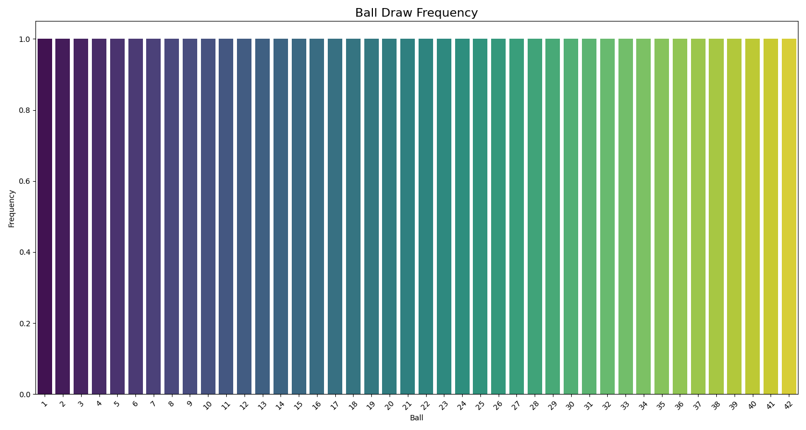

# Africa Lotto Ball Statistics Analysis 🎱📊

 
*Example visualization of ball frequencies*

## Project Overview
This repository contains a comprehensive statistical analysis system for Africa Lotto results, tracking ball frequencies and patterns to identify potential trends in lottery draws. The system automatically collects, analyzes, and visualizes historical data from [Africa Lotto](https://www.africalotto.co.zw).

## Key Features

- **Automated Data Collection**: Daily/weekly scraping of official results
- **Advanced Statistical Analysis**:
  - Ball frequency distributions
  - Co-occurrence patterns
  - Chi-square uniformity testing
  - Hot/Cold number identification
- **Interactive Visualizations**:
  - Frequency bar charts
  - Heatmaps of number pairs
  - Time-series trends
- **Prediction Models**:
  - Basic probability-based predictions
  - Machine learning integration (future)

## Analysis Methodology

### 1. Frequency Analysis
- Tracks how often each ball appears
- Identifies most/least frequent numbers
- Calculates statistical significance (p-values)

### 2. Pattern Detection
```python
# Co-occurrence matrix example
[[0, 15, 4, ...],
 [15, 0, 8, ...],
 [4, 8, 0, ...]]

# Disclaimer
- Information contained therein obtained from [Africa Lotto](https://www.africalotto.co.zw)
